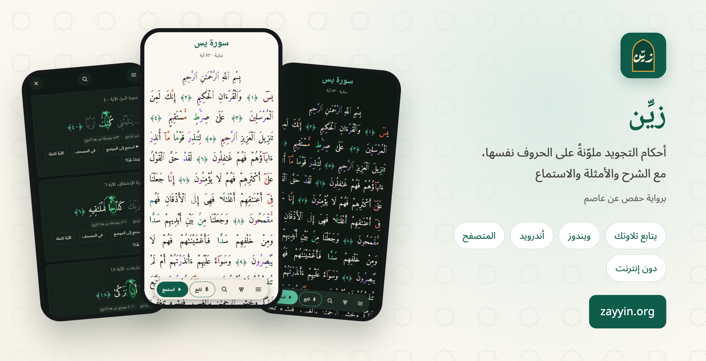
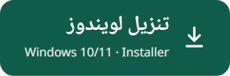
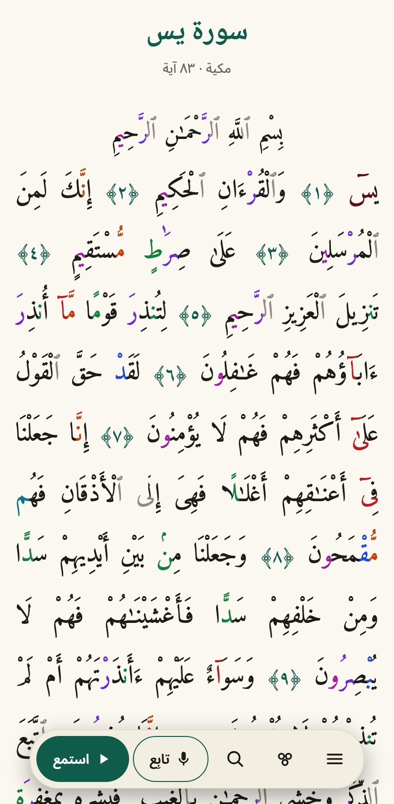
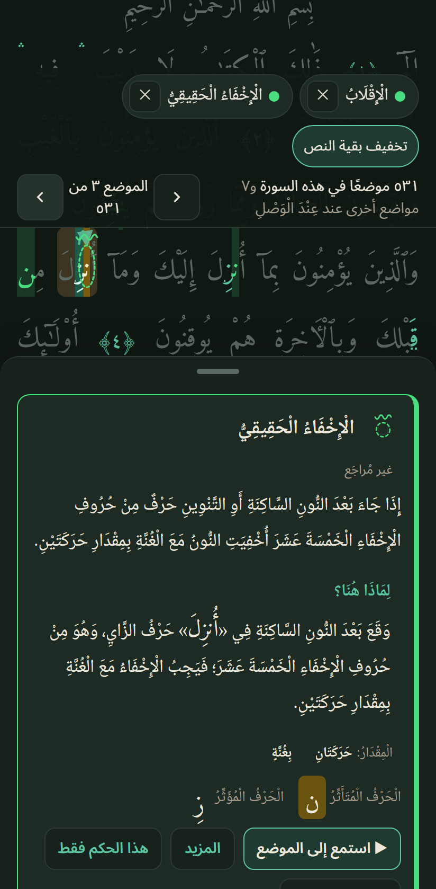
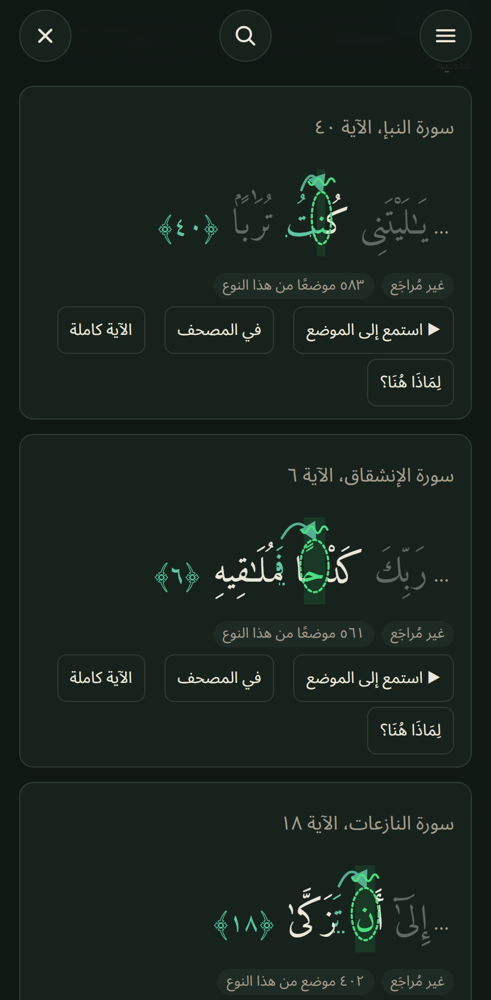
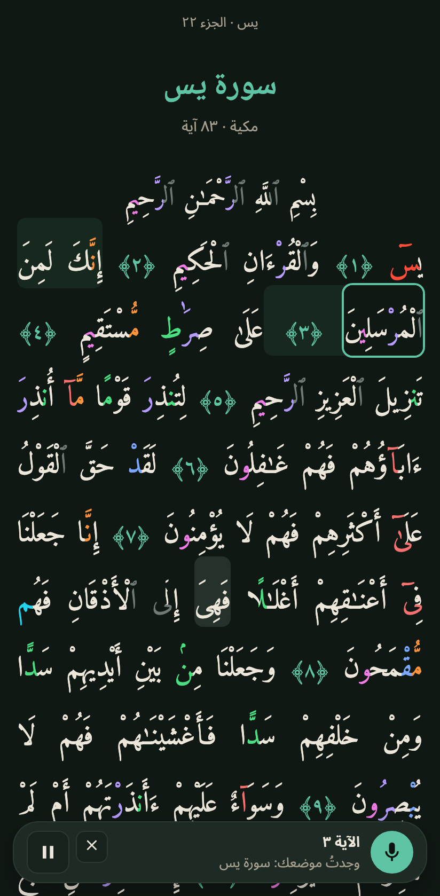
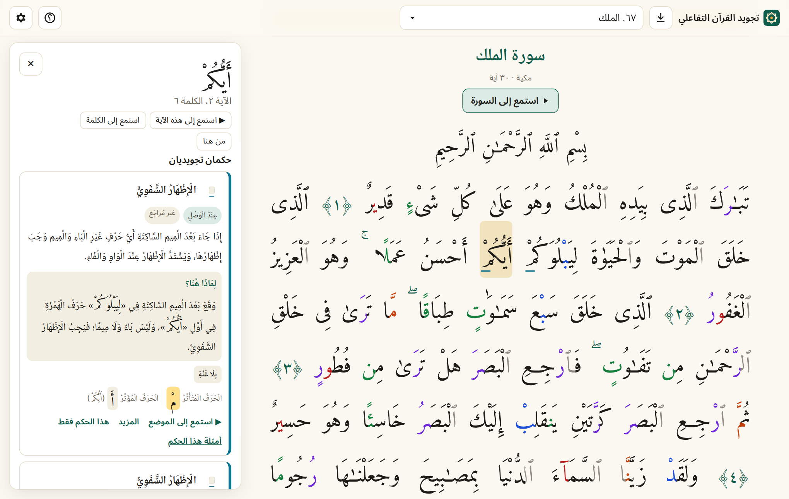

  

  
  
  

## تعلَّم التجويد من المصحف نفسه

**تجويد القرآن التفاعلي** يعرض القرآن الكريم برواية حفص عن عاصم، وأحكامُ التجويد ملوّنةٌ على الحروف التي تقع فيها،
ويشرح كلَّ موضع: ما الحكم؟ ولماذا هنا؟ وكيف يُقرأ؟

- 🎨 **الأحكام على الحروف نفسها** — سبع عائلات ألوان، وعلامات فوق الحروف، في الوقف والوصل.
- 💡 **«لِمَاذَا هُنَا؟»** — اضغط على أي كلمة: يظهر الحكم والحرف المؤثِّر والمتأثِّر وسبب الحكم في هذا الموضع.
- 🔎 **إبراز أحكام مختارة** — اختر حكمًا أو أكثر، فيُبرَز في النص وحده، وتنقّل من موضع إلى موضع.
- 📚 **أمثلة لكل حكم** — أمثلة متنوعة مختارة، وجميع المواضع في السورة أو الجزء أو القرآن كله.
- 🎙️ **يتابع تلاوتك** — اقرأ من حفظك أو من المصحف، من أي سورة: يجد التطبيق موضعك، ويُبرز الكلمة التي تقرؤها، ويمرّر النص معك.
- 🎧 **الاستماع** — إلى السورة أو الآية أو الكلمة أو الموضع نفسه، بصوت ١٧ قارئًا (الحصري افتراضيًا)، مع التكرار؛ وتظهر أحكام الكلمة المتلوّة وعلاماتها على حروفها تلقائيًّا أثناء الاستماع؛ وفي تطبيق أندرويد يستمر الاستماع والشاشة مقفلة.
- 🧭 **القبلة** — اتجاه القبلة بدقة من موقعك أو من إحداثيات تُدخلها، مع البوصلة على الجوال؛ يُحسب على جهازك، ولا يُحفظ الموقع ولا يُرسَل.
- 📱 **تطبيق أندرويد** — مكتوب لأندرويد مباشرة: المصحف بألوان التجويد، وشريط ثابت كبير في الأسفل (القائمة، الألوان، الاستماع، المتابعة) يناسب كبار السن، والتفسير والإعراب، وحفظ القرآن، والقبلة، والمزامنة بين أجهزتك. وفي المتصفح على الجوال: النص وحده، وشريط عائم صغير يفسح المجال عند التمرير.
- 📴 **دون إنترنت** — القرآن كاملًا في التطبيق؛ الصوت وحده يُحمَّل عند التشغيل.
- 🌗 الوضع الداكن افتراضيًّا، والفاتح أو حسب الجهاز · العربية وEnglish وDeutsch · مجاني، بلا إعلانات ولا تتبّع.

<table dir="rtl">
  <tr>
    <td align="center" width="33%"></td>
    <td align="center" width="33%"></td>
    <td align="center" width="33%"></td>
  </tr>
  <tr>
    <td align="center"><b>القراءة</b> الأحكام ملوّنة على الحروف</td>
    <td align="center"><b>أحكام مختارة في النص</b> من موضع إلى موضع مع «لِمَاذَا هُنَا؟»</td>
    <td align="center"><b>أمثلة كل حكم</b> الحرف المؤثِّر والمتأثِّر، والاستماع</td>
  </tr>
</table>

<table dir="rtl">
  <tr>
    <td align="center" width="36%"></td>
    <td dir="rtl" lang="ar">

### 🎙️ يتابع تلاوتك

اضغط **«تابِع تلاوتي»** واقرأ — من حفظك أو من المصحف:

- تُبرَز الكلمة التي تقرؤها ويتحرك النص معك.
- **لا حاجة إلى اختيار السورة:** اقرأ من أي موضع في القرآن، فيجده التطبيق بعد كلمات قليلة وينتقل إليه («وجدتُ موضعك: سورة يس»).
- إن أعدتَ كلمة أو تركتَ كلمة أو توقفت، ثبت الموضع ثم تابع معك.
- **الصوت يبقى على جهازك** — يُعالَج دون إنترنت ولا يُحفظ ولا يُرسَل.

المتابعة تتبّع الموضع فقط، ولا تحكم على التجويد.

</td>
  </tr>
</table>

   
  على الحاسوب: النص وشرح الكلمة جنبًا إلى جنب

## التثبيت

| الجهاز | الطريقة |
|---|---|
| **ويندوز ١٠/١١** | نزّل `Tajwid-Quran-windows-setup.exe` وشغّله (لا يحتاج صلاحيات المدير). عند أول تشغيل قد يظهر «Windows protected your PC» لأن البرنامج غير موقَّع بشهادة تجارية: *More info ← Run anyway*. |
| **أندرويد ٨ أو أحدث** | نزّل [`Tajwid-Quran-android-native.apk`](https://github.com/IslamElawdy/tajwid-quran-visionexor_/releases/latest/download/Tajwid-Quran-android-native.apk) وافتحه، واسمح بالتثبيت من هذا المصدر عند السؤال. من عنده تطبيق أندرويد السابق (`Tajwid-Quran-android.apk`، حتى الإصدار 0.5.6): هذا تطبيق جديد يُثبَّت بجانبه؛ ولنقل العلامات وخطة الحفظ أنشئ «مفتاح مزامنة» في السابق وأدخله في الجديد. |
| **المتصفح** | افتح [tajwid-quran.pages.dev](https://tajwid-quran.pages.dev) — ومن زر التنزيل أعلى الصفحة يمكن حفظ القرآن كاملًا للاستعمال دون إنترنت أو تثبيت الموقع كتطبيق. |

> [!NOTE]
> مواضع التجويد مولَّدة آليًّا من النص، ولم يراجعها أهل العلم بعدُ؛ فإن وجدتَ خطأً فأخبرنا (عنوان التواصل في [البيانات القانونية](https://tajwid-quran.pages.dev/#/legal)).

هذا العمل لوجه الله تعالى، ولمن أراد أن يتعلّم تلاوة القرآن بسهولة.
نسأل الله أن يتقبّله وينفع به.

---

## English

**Tajwid Quran** shows the Qur'an (Ḥafṣ ʿan ʿĀṣim) with the tajwīd rules coloured on the very letters they apply to,
and explains every place: which rule, why here, and how it sounds.

- Tap any word for the rule, the letters involved and the reason — «لِمَاذَا هُنَا؟» (*why here?*).
- Choose one or more rules to highlight them in the text and step from place to place.
- Varied examples for every rule, and all its places in a surah, a juzʾ or the whole Qur'an.
- **Follows your recitation:** recite from memory or from the text, from any surah — the app finds your place,
  highlights the word you are at and scrolls along. No need to open the right surah first. The audio is processed
  on your device only; nothing is recorded or sent. It follows your place and does not judge your tajwīd.
- Listen to a surah, ayah, word or the place itself (17 reciters, al-Ḥuṣarī by default), with repeat; while you
  listen, the rules of the word being recited and their signs appear on its letters; in the Android app
  listening goes on with the screen locked.
- **Qibla:** the exact direction from your location or from coordinates you enter, with a compass on phones —
  computed on your device; the location is neither stored nor sent (on Windows: by entering coordinates).
- **Reading mode in phone browsers:** just the text and a small floating bar (menu, colours,
  follow, listen) that makes room while you scroll.
- The whole Qur'an works offline; only the audio is loaded when you play it.
- Dark by default, light or like the device · Arabic, English, German · free, no ads, no tracking.
- **Android app** (since 0.5.7, written for Android itself): the Mushaf with the tajwīd colours, one fixed bar with
  large buttons at the bottom (made with older readers in mind), listening and following your recitation, tafsir and
  grammar, a hifz plan, Qibla, and sync between your devices. Search, grammar, hifz and Qibla need a current
  “Android System WebView”. If you have the earlier Android app (up to 0.5.6): the new one installs next to it — to
  bring your bookmarks and hifz plan along, create a sync key in the earlier app and enter it in the new one.

| Download | For |
|---|---|
| [`Tajwid-Quran-windows-setup.exe`](https://github.com/IslamElawdy/tajwid-quran-visionexor_/releases/latest/download/Tajwid-Quran-windows-setup.exe) | Windows 10/11, installer (no admin rights needed) |
| [`Tajwid-Quran-android-native.apk`](https://github.com/IslamElawdy/tajwid-quran-visionexor_/releases/latest/download/Tajwid-Quran-android-native.apk) | Android 8 or newer |
| [tajwid-quran.pages.dev](https://tajwid-quran.pages.dev) | Any browser — can also save the whole Qur'an for offline use |

On the first start Windows may show “Windows protected your PC” because the app is not commercially signed:
*More info → Run anyway*. The tajwīd places are generated automatically and not yet reviewed by scholars.

This repository contains only the release files. Sources and licences — Tanzil Qur'an text, EveryAyah recordings,
quran-align word timings, the Amiri Quran font, the Quran-Lab voice model (non-profit licence), the World Magnetic
Model (NOAA/BGS) — are credited on the
website under
[“البيانات القانونية”](https://tajwid-quran.pages.dev/#/legal).
